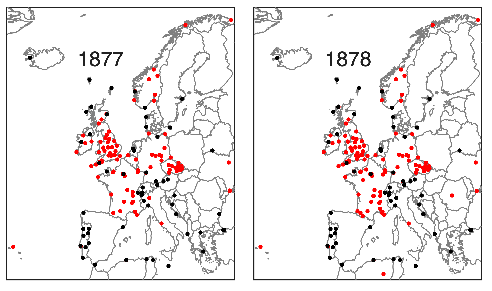

## Existing observations

The maps below show locations of land stations with more than 30 observations in each of the years of 1877 and 1878.

(Currently only for Europe - will update with global picture)
