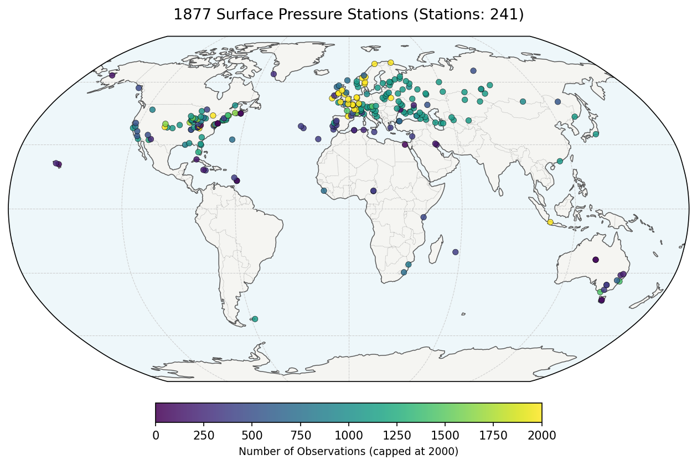
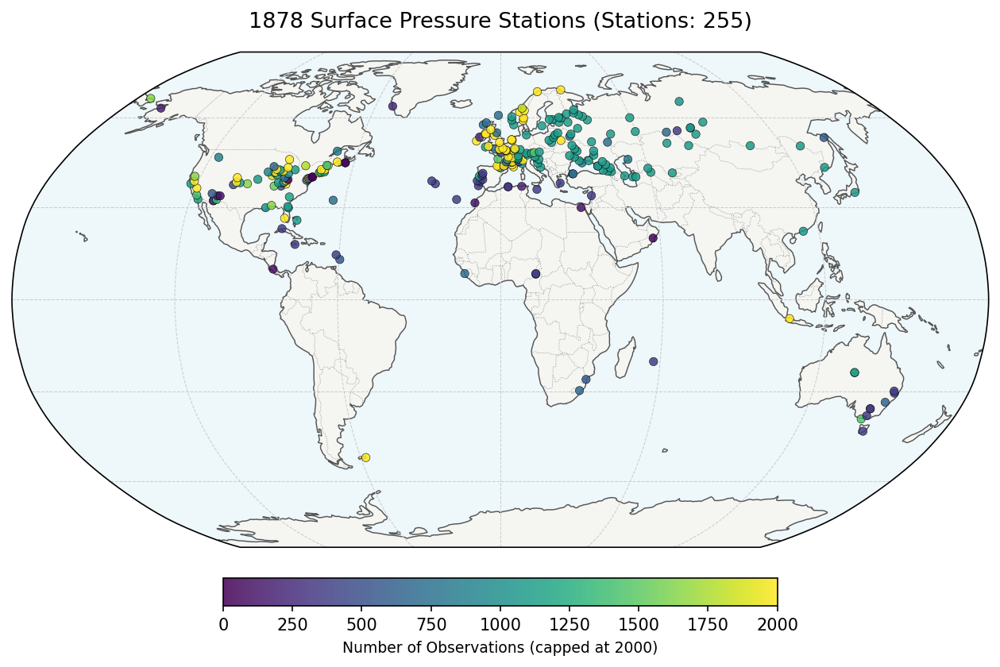
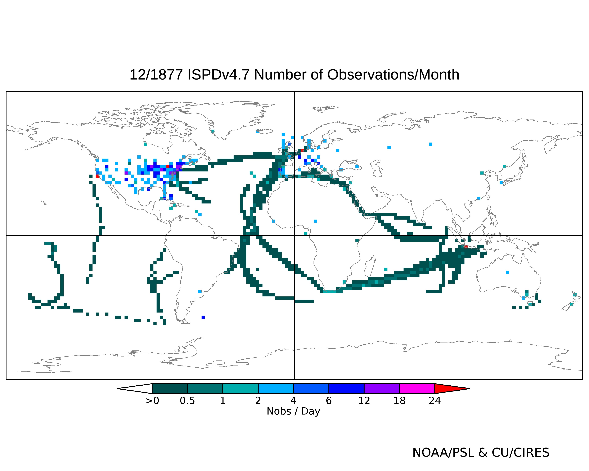

## Existing observations

The maps below show locations of land stations in the GLAMODv8.1 pressure dataset in each of the years of 1877 and 1878.

Interactive views: [1877](https://gws-access.jasmin.ac.uk/public/ncas_climate/ehawkins/RENOIR/pressure_stations_1877.html), [1878](https://gws-access.jasmin.ac.uk/public/ncas_climate/ehawkins/RENOIR/pressure_stations_1878.html)

There are a few more stations which will be added to GLAMOD from ISPDv4.7, and some location corrections needed.

For ships, maps of observation density are found [here](https://psl.noaa.gov/data/20CRv3_ISPD_obscounts_bymonth/) with one example from December 1877 below

